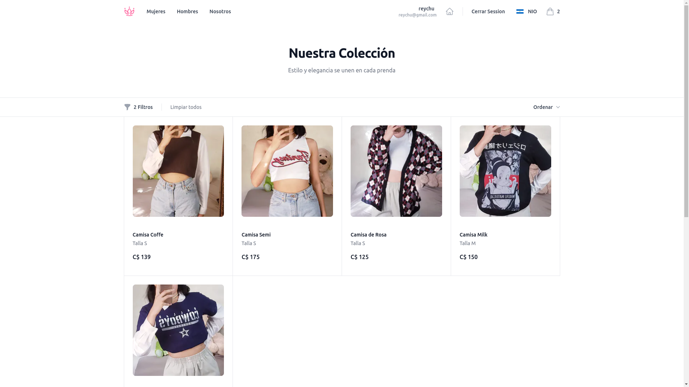

# Clothes Store

## Project Description 🛍️

Clothes Store is an under-construction e-commerce platform designed with React and Next.js. Its goal is to offer a modern shopping experience for online clothing stores. This project is part of my developer portfolio.

## Screenshots / Demonstration 🖼️

Explore a demo of Clothes Store [here.](https://store-monorepo-web.vercel.app)



## Installation 🛠️

This project is a monorepo created with TurboRepo. Make sure you have [pnpm](https://pnpm.io/) installed. To install dependencies, run the following command from the project's root:

```bash
pnpm install
```

## Project Usage 🚀

To build the web application, run the following command:

```bash
pnpm run build
```

To run the application in development mode, use the following command:

```bash
pnpm run dev
```

You can also access individual applications in the `apps` folder and run the same commands.

### Applications and Packages 📦

- `docs`: a [Next.js](https://nextjs.org/) application
- `web`: another [Next.js](https://nextjs.org/) application
- `ui`: a React component library shared by the `web` and `docs` applications
- `eslint-config-custom`: ESLint configurations (includes `eslint-config-next` and `eslint-config-prettier`)
- `tsconfig`: `tsconfig.json` files used throughout the monorepo
- `tailwind`: a package providing style utilities through Tailwind CSS

## Technologies Used 🚀

- TurboRepo
- pnpm
- TypeScript
- Tailwind CSS
- React
- Next.js
- Prisma
- JSPDF
- Zustand
- NextAuth

### Utilities 🧰

This turborepo already has some additional tools set up for you:

- [ESLint](https://eslint.org/) for code linting
- [Prettier](https://prettier.io) for code formatting

## Project Status 🚧

The project is under construction, and continuous improvements are being made in design, functionality, and documentation.

## Contribution 🤝

Currently, the project is mainly intended as part of my portfolio, and specific contribution guidelines have not been established.

## License ⚖️

This project is distributed under the MIT License.
